# TrustExpense - Complete Architecture Documentation

## 📋 Table of Contents
1. [System Overview](#system-overview)
2. [Technology Stack](#technology-stack)
3. [Architecture Diagrams](#architecture-diagrams)
4. [AI/ML Pipeline](#aiml-pipeline)
5. [Component Details](#component-details)
6. [Data Flow](#data-flow)
7. [Deep Learning Models](#deep-learning-models)

---

## 🎯 System Overview

**TrustExpense** is a Flutter-based mobile expense tracking application that uses **real deep learning** to automatically process receipt images.

### Core Features
- 📸 Receipt image capture (camera/gallery)
- 🧠 **CNN-based receipt validation** (MobileNetV2)
- 📝 **OCR text extraction** (Google ML Kit)
- 🤖 **AI-powered categorization** (Gemini AI + keyword fallback)
- 💾 Cloud storage (Supabase)
- 📊 Expense analytics

---

## 🛠️ Technology Stack

### Frontend
```
Flutter 3.x
├── Language: Dart
├── UI Framework: Material Design 3
├── State Management: Provider
└── Platform: iOS, Android, Web
```

### Backend Services
```
Supabase (Backend-as-a-Service)
├── Authentication: Email/Password
├── Database: PostgreSQL
├── Storage: S3-compatible object storage
└── Real-time: WebSocket subscriptions
```

### AI/ML Stack
```
Deep Learning
├── CNN Model: MobileNetV2 (custom-trained)
│   ├── Framework: TensorFlow/Keras
│   ├── Deployment: TensorFlow Lite
│   ├── Size: 2.54 MB
│   └── Inference: On-device (100-200ms)
│
├── OCR: Google ML Kit
│   ├── Type: On-device text recognition
│   ├── Languages: Multi-language support
│   └── Accuracy: 95%+ for printed text
│
└── NLP: Google Gemini AI
    ├── Model: Gemini Pro
    ├── Task: Text classification
    └── Fallback: Keyword-based classifier
```

### Development Tools
```
Development
├── IDE: VS Code / Android Studio
├── Version Control: Git
├── Package Manager: pub (Dart)
├── Build System: Gradle (Android), Xcode (iOS)
└── Testing: Flutter Test Framework
```

---

## 📊 Architecture Diagrams

### 1. High-Level System Architecture


### 2. Receipt Processing Flow

```mermaid
sequenceDiagram
    participant User
    participant Camera
    participant CNN as CNN Detector<br/>(MobileNetV2)
    participant OCR as OCR Service<br/>(ML Kit)
    participant AI as AI Classifier<br/>(Gemini)
    participant DB as Database<br/>(Supabase)
    
    User->>Camera: Capture Receipt
    Camera->>CNN: Validate Image
    
    alt Is Receipt
        CNN-->>User: ✅ Valid Receipt
        User->>OCR: Extract Text
        OCR-->>User: Text Data<br/>(merchant, amount, date)
        User->>AI: Classify Category
        AI-->>User: Category<br/>(Food, Transport, etc.)
        User->>DB: Save Receipt
        DB-->>User: ✅ Saved
    else Not Receipt
        CNN-->>User: ❌ Not a Receipt
        User->>Camera: Retake Photo
    end
```



### 3. CNN Architecture (MobileNetV2)

```mermaid
graph LR
    subgraph "Input"
        IMG[Receipt Image<br/>224×224×3]
    end
    
    subgraph "MobileNetV2 Base"
        CONV1[Conv2D<br/>32 filters]
        BLOCK1[Inverted Residual<br/>Block 1-7]
        BLOCK2[Inverted Residual<br/>Block 8-17]
    end
    
    subgraph "Classification Head"
        GAP[Global Average<br/>Pooling]
        DENSE[Dense 128<br/>ReLU]
        DROP[Dropout 0.5]
        OUT[Dense 1<br/>Sigmoid]
    end
    
    subgraph "Output"
        PROB[Probability<br/>0.0 - 1.0]
    end
    
    IMG --> CONV1
    CONV1 --> BLOCK1
    BLOCK1 --> BLOCK2
    BLOCK2 --> GAP
    GAP --> DENSE
    DENSE --> DROP
    DROP --> OUT
    OUT --> PROB
    
    style IMG fill:#ffe6e6
    style PROB fill:#e6ffe6
    style GAP fill:#e1f5ff
    style DENSE fill:#e1f5ff
    style DROP fill:#e1f5ff
    style OUT fill:#e1f5ff
```



### 4. Data Flow Architecture


---

## 🧠 AI/ML Pipeline

### Pipeline Overview

```
Receipt Image → CNN Validation → OCR Extraction → AI Classification → Database
```

### Detailed Pipeline Steps

#### Step 1: CNN Receipt Detection
```
Purpose: Validate that captured image is actually a receipt
Model: MobileNetV2 (custom-trained)
Input: 224×224 RGB image
Output: Probability (0.0 = not receipt, 1.0 = receipt)
Threshold: 0.5
Processing Time: 100-200ms
```

**How it works:**
1. User captures/selects image
2. Image is resized to 224×224 pixels
3. Pixel values normalized to [0, 1]
4. Image passed through 53 convolutional layers
5. Global average pooling reduces spatial dimensions
6. Dense layers produce final probability
7. If probability > 0.5 → Receipt detected ✅
8. If probability < 0.5 → Not a receipt ❌

#### Step 2: OCR Text Extraction
```
Purpose: Extract text from receipt image
Technology: Google ML Kit (on-device)
Input: Receipt image (any size)
Output: Structured text with bounding boxes
Languages: Auto-detected (supports 100+ languages)
Accuracy: 95%+ for printed text
```

**What it extracts:**
- Merchant name
- Total amount
- Date
- Line items
- Tax information
- All visible text

#### Step 3: AI Classification
```
Purpose: Categorize expense based on text
Primary: Gemini AI (cloud-based)
Fallback: Keyword-based classifier (local)
Categories: 8 (Food, Transport, Shopping, etc.)
Confidence: Provided with each prediction
```

**Classification flow:**
1. Try Gemini AI first
2. If Gemini fails → Use keyword classifier
3. Return category + confidence score

---

## 🏗️ Component Details

### 1. Receipt Detector Service

**File**: `lib/data/services/receipt_detector_service.dart`

**Purpose**: Uses trained CNN to detect if image contains a receipt

**Key Methods:**
```dart
// Initialize the TFLite model
Future<void> initialize()

// Check if image is a receipt
Future<bool> isReceipt(File imageFile)

// Get confidence score (0.0 - 1.0)
Future<double> getConfidence(File imageFile)

// Preprocess image for model input
Future<List<List<List<List<double>>>>> _preprocessImage(File imageFile)
```

**How it works:**
1. Loads `receipt_detector.tflite` model (2.54 MB)
2. Preprocesses image:
   - Decodes image file
   - Resizes to 224×224
   - Normalizes pixels to [0, 1]
   - Converts to 4D tensor [1, 224, 224, 3]
3. Runs CNN inference
4. Returns probability

### 2. OCR Service

**File**: `lib/data/services/ocr_service.dart`

**Purpose**: Extracts text from receipt images using Google ML Kit

**Key Methods:**
```dart
// Process image and extract text
Future<ParsedReceiptData> processImage(File imageFile)

// Extract merchant name from text
String _extractMerchant(List<TextBlock> blocks)

// Extract total amount
double? _extractAmount(String text)

// Extract date
DateTime? _extractDate(String text)
```

**Text Extraction Process:**
1. Initialize ML Kit text recognizer
2. Load image from file
3. Process image through ML Kit
4. Parse recognized text blocks
5. Extract structured data:
   - Merchant (top of receipt)
   - Amount (numbers with currency symbols)
   - Date (date patterns)
   - Full text (all recognized text)

### 3. Gemini AI Service

**File**: `lib/data/services/gemini_ai_service.dart`

**Purpose**: Classifies receipt text into expense categories using Gemini AI

**Key Methods:**
```dart
// Initialize Gemini model
Future<void> initialize()

// Classify receipt text
Future<String> classifyReceipt(String receiptText)
```

**Classification Process:**
1. Initialize Gemini Pro model with API key
2. Create classification prompt:
   ```
   "Classify this receipt into one of these categories:
   Food, Transport, Shopping, Entertainment, Health, 
   Services, Housing, Other.
   
   Receipt text: [OCR text]
   
   Respond with ONLY the category name."
   ```
3. Send to Gemini API
4. Parse response
5. Validate category
6. Return category or fallback to keyword classifier

### 4. AI Classification Service (Fallback)

**File**: `lib/data/services/ai_classification_service.dart`

**Purpose**: Keyword-based classification when Gemini is unavailable

**How it works:**
1. Maintains keyword dictionaries for each category
2. Converts text to lowercase
3. Counts keyword matches per category
4. Returns category with most matches
5. Defaults to "Other" if no matches

**Keywords Example:**
```dart
'Food': [
  'restaurant', 'cafe', 'pizza', 'burger',
  'grocery', 'supermarket', 'carrefour',
  'pain', 'lait', 'fromage' // French
]
```

---

## 📦 Data Models

### Receipt Model
```dart
class Receipt {
  final String id;              // Unique identifier
  final String userId;          // Owner
  final String merchant;        // Store name
  final double amount;          // Total cost
  final String category;        // Expense category
  final DateTime date;          // Purchase date
  final String? imageUrl;       // Receipt image URL
  final String? notes;          // User notes
  final DateTime createdAt;     // Record creation time
}
```

### Parsed Receipt Data
```dart
class ParsedReceiptData {
  final String? merchant;       // Extracted merchant
  final double? amount;         // Extracted amount
  final DateTime? date;         // Extracted date
  final String rawText;         // Full OCR text
}
```

---

## 🔄 Complete User Flow

### Receipt Capture to Save


---

## 🎓 Deep Learning Model Details

### MobileNetV2 Architecture

**Total Parameters**: 3,538,984
- Trainable: 3,504,872
- Non-trainable: 34,112

**Layer Breakdown**:
```
Input Layer (224×224×3)
    ↓
Conv2D (32 filters, 3×3, stride 2)
    ↓
Inverted Residual Blocks (×17)
├── Expansion (1×1 conv)
├── Depthwise (3×3 conv)
└── Projection (1×1 conv)
    ↓
Conv2D (1280 filters, 1×1)
    ↓
Global Average Pooling
    ↓
Dense (128 units, ReLU)
    ↓
Dropout (0.5)
    ↓
Dense (1 unit, Sigmoid)
    ↓
Output (probability)
```

### Training Details

**Dataset**:
- Receipts: 973 images (SROIE2019)
- Non-receipts: 973 images (ImageNet)
- Total: 1,946 images
- Split: 80% train, 20% validation

**Training Configuration**:
```python
Optimizer: Adam
Learning Rate: 0.001 (initial), 0.0001 (fine-tune)
Loss: Binary Crossentropy
Metrics: Accuracy, Precision, Recall
Batch Size: 32
Epochs: 20 (initial) + 5 (fine-tune)
```

**Data Augmentation**:
- Rotation: ±10°
- Width/Height shift: 10%
- Zoom: 10%
- Brightness: 80-120%

**Performance**:
- Training Accuracy: 100%
- Validation Accuracy: 95-100%
- Inference Time: 100-200ms
- Model Size: 2.54 MB (TFLite)

---

## 📱 Screen Flow

```
Home Screen
    ↓
[Tap Scan Button]
    ↓
Capture Screen (Bottom Sheet)
├── Take Photo
└── Choose from Gallery
    ↓
Image Preview Screen
├── [Retake] → Back to Capture
└── [Confirm] → CNN Validation
    ↓
    ├─ Not Receipt → Error → Home
    └─ Is Receipt → Processing
        ↓
    Receipt Processing Screen
    ├── OCR Extraction
    ├── AI Classification
    └── Image Upload
        ↓
    Receipt Form Screen
    ├── Edit merchant
    ├── Edit amount
    ├── Edit category
    ├── Edit date
    └── Add notes
        ↓
    [Save] → Database
        ↓
    Summary Screen (Updated)
```

---

## 🔐 Security & Privacy

### Data Storage
- **Images**: Encrypted in Supabase Storage
- **Receipts**: PostgreSQL with Row Level Security
- **Auth**: JWT tokens with refresh mechanism

### API Keys
- **Gemini AI**: Stored in `gemini_config.dart` (NOT in version control)
- **Supabase**: Environment-specific configuration

### Permissions
- **Camera**: Required for photo capture
- **Photos**: Required for gallery access
- **Internet**: Required for cloud services

---

## 🚀 Performance Optimization

### CNN Optimization
- **TensorFlow Lite**: Reduced model size (14 MB → 2.54 MB)
- **Quantization**: INT8 quantization for faster inference
- **On-device**: No network latency

### Image Processing
- **Lazy Loading**: Images loaded only when needed
- **Caching**: Processed images cached locally
- **Compression**: Images compressed before upload

### Database
- **Indexing**: Indexed on userId, date, category
- **Pagination**: Load receipts in batches
- **Real-time**: Only subscribe to user's data

---

## 📚 Dependencies

### Core Flutter
```yaml
flutter: sdk
cupertino_icons: ^1.0.8
```

### State Management
```yaml
provider: ^6.1.2
```

### Backend
```yaml
supabase_flutter: ^2.3.4
```

### AI/ML
```yaml
google_mlkit_text_recognition: ^0.13.0
google_generative_ai: ^0.4.0
tflite_flutter: ^0.11.0
image: ^4.1.7
```

### UI/UX
```yaml
intl: ^0.19.0
image_picker: ^1.0.7
permission_handler: ^11.3.0
```

---

## 🎯 Summary

**TrustExpense** demonstrates a complete AI/ML pipeline:

1. **CNN** for image validation (MobileNetV2)
2. **OCR** for text extraction (Google ML Kit)
3. **NLP** for classification (Gemini AI)
4. **Cloud Backend** for data persistence (Supabase)
5. **Mobile App** for user interaction (Flutter)

**Key Achievements**:
- ✅ Real deep learning (not just API calls)
- ✅ On-device inference (privacy + speed)
- ✅ Custom-trained model (transfer learning)
- ✅ Production-ready architecture
- ✅ Comprehensive documentation

**Perfect for demonstrating deep learning concepts in a class presentation!** 🎓
